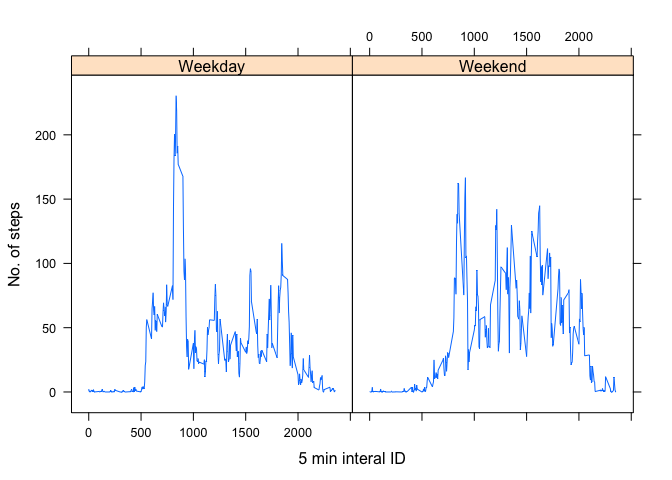

# Reproducible Research: Peer Assessment 1


## Loading and preprocessing the data


```r
unzip("activity.zip")
data<-read.csv("activity.csv")
head(data)
```

```
##   steps       date interval
## 1    NA 2012-10-01        0
## 2    NA 2012-10-01        5
## 3    NA 2012-10-01       10
## 4    NA 2012-10-01       15
## 5    NA 2012-10-01       20
## 6    NA 2012-10-01       25
```


## What is mean total number of steps taken per day?


```r
sdata<-split(data, data$date)
stepsPerDay<-sapply(sdata, function(x) sum(x$steps, na.rm=TRUE))
hist(stepsPerDay, breaks=25, ylab="Count")
```

 

```r
mean(stepsPerDay)
```

```
## [1] 9354.23
```

```r
median(stepsPerDay)
```

```
## [1] 10395
```

## What is the average daily activity pattern?


```r
sdata2<-split(data,data$interval)
stepsPerInterval<-sapply(sdata2, function(x) mean(x$steps, na.rm=TRUE))
interval<-data$interval
intervalUnique<-unique(interval)
plot(intervalUnique,stepsPerInterval, type="l", xlab="5 min interval ID", ylab="Steps across all days")
```

 

```r
which.max(stepsPerInterval)
```

```
## 835 
## 104
```


## Imputing missing values


```r
data2<-data
nas<-is.na(data2$steps)
sdata3<-split(data,data$interval)
stepsPerInterval<-sapply(sdata3, function(x) mean(x$steps, na.rm=TRUE))
data2$steps[nas]<-stepsPerInterval[as.character(data2$interval[nas])]
#data2 now contains missing values filled with mean value


#this sections splits the data2 and gives mean and median
sdata<-split(data2, data2$date)
stepsPerDay<-sapply(sdata, function(x) sum(x$steps, na.rm=TRUE))
hist(stepsPerDay, breaks=25, ylab="Count")
```

 

```r
mean(stepsPerDay)
```

```
## [1] 10766.19
```

```r
median(stepsPerDay)
```

```
## [1] 10766.19
```

## Are there differences in activity patterns between weekdays and weekends?


```r
wd<-weekdays(as.Date(data2$date))
for (i in 1:length(wd)){
  if(wd[i]=="Monday"||wd[i]=="Tuesday"||wd[i]=="Wednesday"||wd[i]=="Thursday"||wd[i]=="Friday"){
    wd[i]<-"Weekday"
  }
  else
    wd[i]<-"Weekend"
}

data3<-cbind(wd,data2)
sdata3<-split(data3,data3$interval)
stepsPerInterval<-sapply(sdata3, function(x) mean(x$steps, na.rm=TRUE))
interval<-data3$interval
intervalUnique<-unique(interval)
plot(stepsPerInterval~intervalUnique, type="l", xlab="5 min interval ID")
```

 
